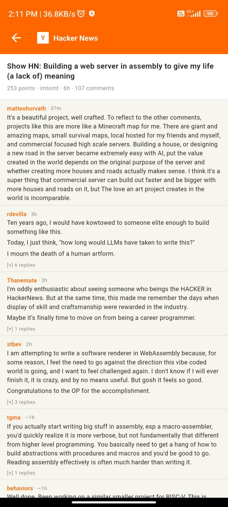
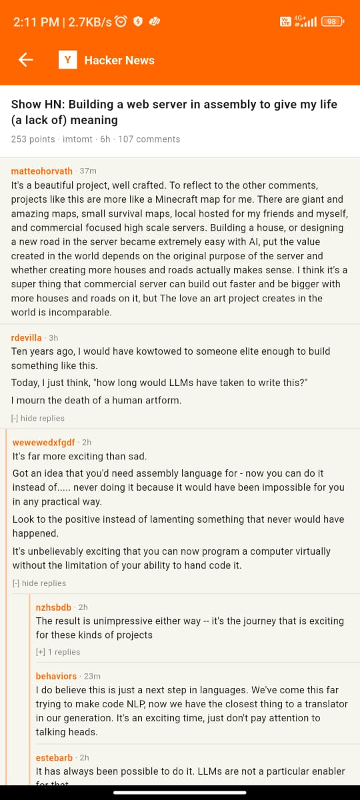

# 📰 HN Reader — Hacker News Flutter App

<div align="center">


**A minimal, fast, and authentic Hacker News reader — built with Clean Architecture and Flutter.**

[⬇️ Download APK](#-download) · [🏗️ Architecture](#-architecture) · [✨ Features](#-features)

</div>

---

## 📱 Screenshots

| Home Screen | Detail Screen | Nested Comments |
|:-----------:|:-------------:|:---------------:|
|  |  |  |
| Top stories with rank, score, domain | Story header + comment thread | Recursive nested comments with thread lines |

> **UI matches the real [news.ycombinator.com](https://news.ycombinator.com) aesthetic** — off-white `#F6F6EF` background, HN orange `#FF6600`, minimal and developer-focused.

---

## ⬇️ Download

> **[⬇️ Download Latest APK](https://github.com/Ganesh-AIML/hn-reader-flutter/releases/latest/download/app-release.apk)**

Or go to [Releases](https://github.com/Ganesh-AIML/hn-reader-flutter/releases) and download `app-release.apk`.

---

## ✨ Features

| Feature | Details |
|---|---|
| 🗂️ Top Stories | Fetches live top stories from the official HN Firebase API |
| ♾️ Infinite Scroll | Loads 20 stories at a time, auto-fetches on scroll |
| 🔄 Pull to Refresh | Swipe down to reload the latest stories |
| 💬 Comments | First-level + recursive nested comments via `kids[]` parsing |
| 🧵 Thread Lines | Depth-aware orange thread lines for nested comment hierarchy |
| 📖 HTML Rendering | Comment HTML rendered properly via `flutter_html` |
| ⏱️ Time Formatting | Short relative time (`5h ago`) via `timeago` |
| 💀 Dead/Deleted Filter | Filters out `deleted: true` and `dead: true` comments automatically |
| 👻 Shimmer Loading | Skeleton shimmer placeholder while stories load |
| ⚠️ Error + Retry | Full error state with retry button on all screens |
| 🔗 Open Links | Tap story title to open original URL in browser |

---

## 🏗️ Architecture

Built with **Clean Architecture** — strict separation across 3 layers:

```
Presentation  →  Domain  →  Data
   (UI/BLoC)     (Entities,     (Models,
                  UseCases,      Repository
                  Repository     Impl, API)
                  Interface)
```

### Directory Structure

```
lib/
├── core/
│   ├── constants/        # API base URLs
│   ├── errors/           # Failure classes
│   └── network/          # Dio client singleton
│
├── data/
│   ├── models/           # StoryModel, CommentModel (fromJson)
│   └── repositories/     # HNRepositoryImpl
│
├── domain/
│   ├── entities/         # Story, Comment (pure Dart)
│   ├── repositories/     # Abstract HNRepository
│   └── usecases/         # GetTopStories, GetStoryDetail, GetComments
│
├── presentation/
│   ├── cubits/           # StoriesCubit, DetailCubit + States
│   ├── screens/
│   │   ├── home/         # HomeScreen + StoryTile
│   │   └── detail/       # DetailScreen + CommentTile (recursive)
│   └── widgets/          # Shared AppErrorWidget
│
├── injection_container.dart   # get_it DI setup
└── main.dart
```

---

## 🔌 API

Uses the official [Hacker News Firebase API](https://github.com/HackerNews/API):

| Endpoint | Purpose |
|---|---|
| `GET /v0/topstories.json` | Fetch list of top story IDs |
| `GET /v0/item/{id}.json` | Fetch story or comment by ID |

**Parallel fetching** via `Future.wait()` for efficient batch loading of story details.

---

## 📦 Packages

| Package | Purpose |
|---|---|
| `flutter_bloc` | State management (Cubit) |
| `dio` | HTTP networking |
| `equatable` | Value equality for entities/states |
| `get_it` | Dependency injection |
| `flutter_html` | Render HTML in comment bodies |
| `timeago` | Relative time formatting (`5h ago`) |
| `shimmer` | Skeleton loading placeholder |
| `url_launcher` | Open story URLs in browser |

---

## 🚀 Running Locally

```bash
# Clone the repo
git clone https://github.com/Ganesh-AIML/hn-reader-flutter.git
cd hn-reader-flutter

# Install dependencies
flutter pub get

# Run on connected Android device
flutter run

# Build release APK
flutter build apk --release
```

**Requirements:** Flutter 3.x · Dart 3.x · Android SDK

---

## 🧠 Key Engineering Decisions

**Why `Future.wait()` for story fetching?**
`topstories.json` returns only IDs — parallel fetching all details simultaneously is significantly faster than sequential calls.

**Why Cubit over full Bloc?**
Less boilerplate, simpler event model — sufficient for this use case and easier to explain during code pairing.

**Why recursive `CommentTile` widget?**
HN comments are arbitrarily nested. A recursive stateful widget with lazy loading (children fetched only on expand) handles infinite depth without performance issues.

**Why `flutter_html` for comments?**
HN API returns comment text as raw HTML (with `<p>`, `<i>`, `<a>` tags). Rendering as plain `Text()` would show broken markup.

---

## 👨‍💻 Built By

**Ganesh Singh** — B.Tech AI & ML, TCET Mumbai  
[GitHub](https://github.com/Ganesh-AIML) · [Portfolio](https://ganesh-aiml.github.io/My-Resume/) · [LinkedIn](https://www.linkedin.com/in/ganesh-singh-aiml)